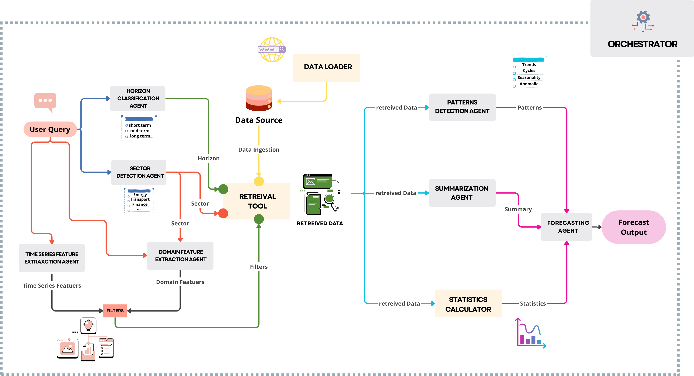

# Forecasting as Reasoning  
**Retrieval-Augmented Multi-Agent LLMs for Interpretable Time Series Forecasting**

This repository contains the reference implementation for the paper:

> **Forecasting as Reasoning: A Retrieval-Augmented Multi-Agent LLM Framework for Interpretable Time Series Forecasting**

  

This paper introduced a retrieval-augmented, agent-based framework that reformulates time series forecasting as a structured, language-driven reasoning process over historical temporal evidence. By decomposing forecasting into modular components—including deterministic retrieval, statistical grounding, temporal pattern analysis, data summarization, and synthesis—the proposed system enables interpretable, flexible, and reproducible forecasting in response to natural language queries.

---

## Core Principles

Our primary contributions are:

- **Forecasting as Deterministic Evidence-Grounded Reasoning.**
We formalize time series forecasting as a modular reasoning process over deterministically retrieved temporal contexts, rather than as end-to-end parametric sequence modeling. This perspective transforms forecasting from function approximation into structured, interpretable decision-making conditioned on verifiable historical slices.

- **DataFrame-Grounded Retrieval for Numerical Fidelity.**
We introduce a deterministic, schema-aligned retrieval operator that operates directly on structured time-series tables, avoiding embedding-based similarity search. Unlike vector retrieval, our method guarantees exact timestamp alignment, numerical fidelity, and full reproducibility across executions.

- **Modular Multi-Agent Forecasting Architecture.**
We design a coordinated, role-specialized agent framework comprising horizon classification, feature extraction, statistical grounding, summarization, pattern detection, and forecast synthesis under centralized orchestration. This decomposition enables controlled ablation, backend-agnostic evaluation, and transparent intermediate reasoning artifacts.

- **Reproducibility-Centric Evaluation of LLM Forecasting.**
We introduce a systematic reproducibility protocol that quantifies run-to-run numerical dispersion, coefficient of variation, and worst-step instability under repeated identical executions. This analysis exposes backend-dependent stochasticity and provides an operational perspective on deployment stability.

- **Comprehensive Backend and Component Analysis.**
Across four state-of-the-art LLM backends, we demonstrate that structured retrieval and statistical grounding materially improve forecasting accuracy and stability relative to prompt-only baselines and component-wise ablations.

---

## Repository Structure
.
├── experiments/
│   ├── Claude/                 # Experiments outputs (Claude)
│   ├── Deepseek/               # Experiments outputs (DeepSeek)
│   ├── Gemini/                 # Experiments outputs (Gemini)
│   ├── OpenAI/                 # Experiments outputs (OpenAI)
│   ├── eval/                   # Evaluation utilities
│   ├── queries/                # Query sets used for evaluation
│   ├── stubs/                  # Stubs/mocks for controlled experiments
│   ├── utils/                  # Experiment helpers
│   └── yamls/                  # Experiment configurations
│   └── scripts/                # Run Experiments
│
├── agents/
│   ├── orchestration_agent.py    # Central orchestrator
│   ├── sector_detector.py        # Domain detection Agent
│   ├── timeseries_features.py    # Temporal feature extraction Agent
│   ├── energy_features.py        # Energy-domain feature extraction Agent
│   ├── retrieval.py              # Deterministic DataFrame retrieval
│   ├── statistics_calculation.py # Tool-based statistics
│   ├── summarization.py          # Token-efficient summarization Agent
│   ├── pattern_detection.py      # Patterns detection Agent
│   ├── forecast_narrative.py     # Forecasting Agent
│   └── redirecting_agent.py      # Horizon classification Agent
│
├── data/                       # Dataset and processed data
├── utils/                      # Shared utilities
│
├── interface.py                # Lightweight interactive interface
├── main.py                     # Main end-to-end entry point
│
├── requirements.txt
├── .env                        # Environment variables 
└── README.md

---

## Setup

### 1. Environment

python -m venv .venv
source .venv/bin/activate      
pip install -r requirements.txt 

### 2. Environment Variables

Create a .env file at the project root:

- OPENAI_API_KEY="..."
- DEEPSEEK_API_KEY="..."
- GEMINI_API_KEY="..."
- ANTHROPIC_API_KEY="..."

## Running the System

### End-to-End Forecasting
python main.py

### Interactive Mode
streamlit run interface.py

## Forecasting Workflow (Per Query)

- **Orchestrator** (agent routing, state propagation, deterministic logging, and ablation control)
- Sector detection (optional, multi-domain)
- Horizon classification (short / mid / long)
- Feature extraction (temporal + domain filters)
- Deterministic DataFrame retrieval
- Statistical grounding (tool-computed)
- Summarization (context compression)
- Pattern detection (trend, seasonality, anomalies)
- Forecast synthesis (prediction + rationale)

All intermediate artifacts are explicit and inspectable.

## Ablation Studies

### Single Configuration
python ablate_model.py

### Parallel Ablations
python ablate_parallel.py

### Configuration Files

All experiments are driven by YAML files in:
ablation/yamls/

Each ablation disables an agent or a tool while keeping other components fixed.