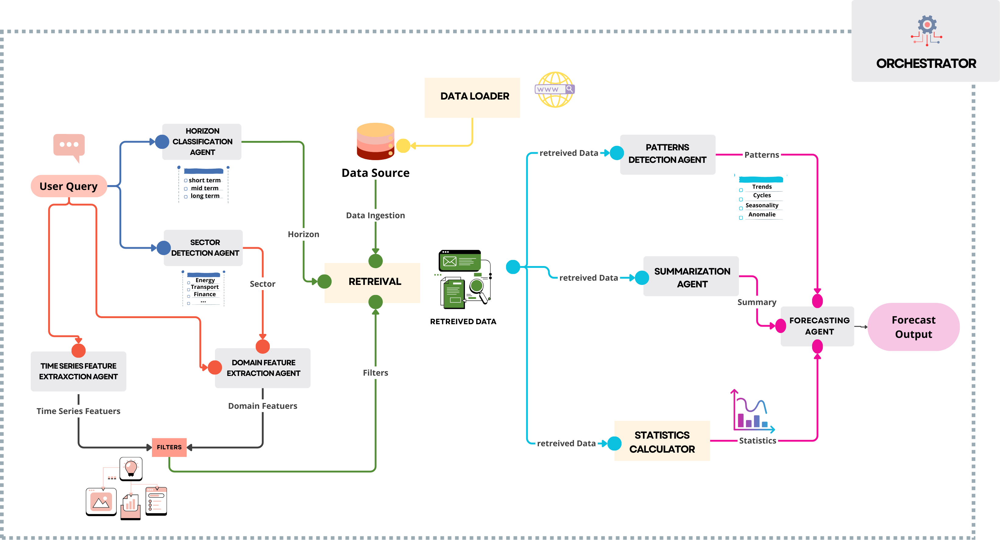

# Forecasting as Reasoning
**A Retrieval-Augmented Multi-Agent Large Language Model Framework for Time Series Forecasting**

This repository contains the reference implementation for the paper:

> **Forecasting as Reasoning: A Retrieval-Augmented Multi-Agent Large Language Model Framework for Time Series Forecasting**

<p align="center">
  
</p>

The framework answers natural-language forecasting queries by decomposing forecasting into specialized stages: query interpretation, horizon classification, deterministic retrieval over tabular time-series data, statistical grounding computed by deterministic tools, summarization, pattern detection, and forecast synthesis by a large language model. Every intermediate output is logged.

---

## Scope

All experiments in the paper use one data source: regional electricity demand (`TOTALDEMAND`) and regional reference price (`RRP`) for the five regions of the Australian National Electricity Market (NSW1, QLD1, SA1, TAS1, VIC1), published by the Australian Energy Market Operator (AEMO). No other domain was evaluated. The retrieval filters, domain feature extraction, and prompts are written for this data schema. The framework produces point forecasts (single-timestamp or multi-step); it does not produce predictive intervals.

## Components

- **Deterministic retrieval.** Historical rows are selected by schema-aligned filters on the tabular data, not by embedding similarity. Given the same horizon class and extracted filters, retrieval returns the same rows.
- **Statistical grounding.** Descriptive statistics, autocorrelations, temporal profiles, data-quality indicators, and correlations are computed by deterministic code and passed to the forecasting model.
- **Specialized agents.** Sector detection, horizon classification, time-series and domain feature extraction, summarization, pattern detection, forecasting, and an optional verification agent, coordinated by an orchestrator.
- **Repeated-execution protocol.** Each query is executed several times under identical settings to measure run-to-run dispersion of the forecasts for each backend. The LLM calls are not deterministic, even at temperature 0; the protocol measures this variability rather than removing it.

---

## Repository Structure

```text
.
├── README.md
├── requirements.txt
├── main.py                        # single-query entry point
├── interactive.py                 # Streamlit query interface
├── assets/architecture.png
├── utils/
│   ├── model_registry.py          # backend presets, endpoints, and the LLM adapter
│   └── text_utils.py
├── agents/
│   ├── orchestration_agent.py     # runs the full pipeline for one query
│   ├── sector_detector.py
│   ├── redirecting_agent.py       # horizon classification
│   ├── timeseries_features.py     # temporal filter extraction
│   ├── energy_features.py         # domain filter extraction
│   ├── retrieval.py               # deterministic retrieval tool
│   ├── statistics_calculation.py  # statistical grounding tool
│   ├── summarization.py
│   ├── pattern_detection.py
│   ├── forecast_narrative.py      # forecasting agent
│   └── verification_agent.py      # optional verification loop
├── data/
│   ├── extract_data.ipynb         # download and merge AEMO monthly files
│   ├── generator.py               # queries generator for evaluation
│   └── data_processing.py  
└── experiments/
    ├── queries/
    │   └── queries_eval.json      # the evaluation queries passed to the pipeline
    ├── yamls/                     # per-backend configurations: full system, four ablations, seeds
    ├── scripts/
    │   ├── ablate.py              # sequential experiment runner
    │   ├── ablate_parallel.py     # parallel experiment runner
    │   └── test_verification.py   # verification agent test
    ├── stubs/                     # instrumented pipeline and adapter (logs tokens, cost, latency, traces)
    ├── utils/                     # token pricing, tracing, logging, I/O helpers
    ├── outputs/*/*_parser.py      # extraction of forecast values from each backend's outputs
    ├── baselines/                 # statistical, foundation-model, trained neural, and prompt-only baselines
    └── eval/                      # confidence intervals, significance tests, ablation tests,
                                   # groundedness audit, cost recomputation, evaluation notebooks
```

Not stored in the repository (excluded by `.gitignore`): the AEMO archive, all intermediate and result CSV files, and the run traces. The archive can be regenerated from the public AEMO files (see Data below).

---

## Setup

Two Python environments were used.

### 1. Main environment (Python 3.9): pipeline, statistical baselines, Temporal Fusion Transformer, Chronos, evaluation

```bash
python -m venv .venv
source .venv/bin/activate
pip install -r requirements.txt
```

### 2. Foundation-model environment (Python 3.11): TimesFM and Moirai

```bash
python3.11 -m venv tsfm_env
source tsfm_env/bin/activate
pip install timesfm==2.0.2 uni2ts==2.0.0
```

### 3. API keys

The forecasting pipeline calls hosted LLM APIs. Create a `.env` file at the repository root (it is excluded from version control) containing a key for each backend you want to run:

```text
OPENAI_API_KEY="..."
DEEPSEEK_API_KEY="..."
GEMINI_API_KEY="..."
ANTHROPIC_API_KEY="..."
```

| Variable | Backend (preset in `utils/model_registry.py`) | Endpoint |
|---|---|---|
| `OPENAI_API_KEY` | GPT-4o mini (`openai-mini`) | OpenAI API |
| `DEEPSEEK_API_KEY` | DeepSeek Chat (`deepseek-chat`) | `https://api.deepseek.com` |
| `GEMINI_API_KEY` | Gemini 2.5 Flash (`gemini-flash-native`) | Google Generative AI SDK |
| `ANTHROPIC_API_KEY` | Claude Sonnet 4.5 (`claude-api`) | `https://api.anthropic.com/v1/` (OpenAI-compatible) |

Keys are needed for `main.py`, `interactive.py`, the experiment runners, the prompt-only baseline, and the verification test. No key is needed to download the data, run the statistical, foundation-model, or Temporal Fusion Transformer baselines, or run the evaluation scripts. API usage is billed by each provider.

Optional: `ABLATION_MAX_MODEL_WORKERS` sets the number of parallel workers used by `ablate_parallel.py`.

---

## Data

Run `data/extract_data.ipynb` to download the AEMO monthly `PRICE_AND_DEMAND` files for the five regions and merge them into one CSV. The baseline scripts read `data/processed_data.csv` by default.

The archive is recorded at 30-minute intervals before October 2021 and at 5-minute intervals from October 2021. To reproduce the paper's evaluation, restrict the data to observations before the cutoff `2025-04-30 23:30:00` (Australia/Sydney); otherwise newer AEMO releases will be included.

---

## Running

### Single query

```bash
python main.py
```

The backend preset and the query are set inside `main.py` (presets: `openai-mini`, `deepseek-chat`, `gemini-flash-native`, `claude-api`).

### Interactive interface

```bash
streamlit run interactive.py
```

### Experiments (full system and ablations)

Each backend has a configuration file in `experiments/yamls/` listing the full-system configuration, the four single-component ablations, and the seeds. The runners take no command-line arguments; set the constants at the top of the script before running:

| Constant | Value for the paper's experiments |
|---|---|
| `DEFAULT_YAML` | `experiments/yamls/<backend>.yaml` |
| `DEFAULT_QUERIES` | `experiments/queries/queries_eval.json` |
| `OUTPUT_ROOT` | any output directory |

```bash
python experiments/scripts/ablate_parallel.py   # or experiments/scripts/ablate.py
```

### Baselines

```bash
# Persistence, Seasonal Naive, SARIMA (main environment)
python experiments/baselines/run_baselines.py --cutoff "2025-04-30 23:30:00"

# ETS, Theta, Prophet (main environment)
python experiments/baselines/run_ets_theta_prophet.py

# Temporal Fusion Transformer (main environment)
python experiments/baselines/tft_baseline.py

# TimesFM and Moirai (foundation-model environment)
python experiments/baselines/timesfm_baseline.py
python experiments/baselines/moirai_baseline.py

# Prompt-only LLM baseline (main environment, API keys required)
python experiments/baselines/prompt_only_baseline.py --backends openai-mini deepseek-chat claude-api gemini-flash-native
```

### Evaluation

| Script | Purpose |
|---|---|
| `experiments/eval/full_significance_analysis.py` | Bootstrap confidence intervals; Wilcoxon and Diebold–Mariano tests with Holm–Bonferroni correction |
| `experiments/eval/significance_testing.py` | Shared error-extraction and bootstrap functions |
| `experiments/eval/ablation_significance.py` | Paired tests for the component ablations |
| `experiments/eval/groundedness.py` | Numeric traceability audit of forecast rationales |
| `experiments/eval/recompute_costs.py` | Recomputes cost per run from logged token counts |
